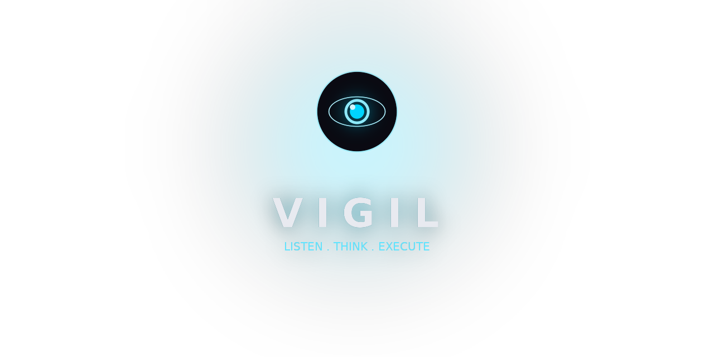

<p align="center">
  
</p>

<p align="center">
  <strong>Offline voice assistant &amp; dictation for Linux — dictate text anywhere.</strong>
</p>

<p align="center">
  
  
  
  
  
  
  
</p>

---

## What is Vigil?

Vigil sits in your system tray and gives you two modes:

| Mode | Default hotkey | What it does |
|---|---|---|
| **Dictation** | `Ctrl+Alt+W` | Transcribes your voice and pastes text directly into whichever app has focus — editors, browsers, chat windows, anything. |
| **Assistant** | `Ctrl+Alt+R` | Understands natural-language commands: search the web, query your Obsidian vault, launch or close apps — all by voice. |

Everything runs **locally**: speech recognition via [faster-whisper](https://github.com/SYSTRAN/faster-whisper), LLM via [llama.cpp](https://github.com/ggml-org/llama.cpp), optional TTS via [Piper](https://github.com/rhasspy/piper). No cloud, no API keys, no telemetry.

---

## Features

- **Toggle-mode dictation** — press once to start recording, press again to paste
- **Voice assistant** — natural-language commands handled locally by the LLM
- **Web search** — ask the assistant to look something up; answer spoken aloud
- **Obsidian vault search** — query your markdown notes by voice
- **App launcher** — open or close any installed app by name (searches `.desktop` files + PATH)
  - **Fuzzy matching** — phonetic approximations work ("dolfine" → Dolphin); single match auto-launches, multiple matches show a numbered list
  - **Multi-turn confirmation** — press the assistant hotkey again to reply with a number; answer card stays visible until resolved
- **Multi-turn context** — the assistant remembers the last 10 turns for up to 30 seconds; context level shown via Pandora eye color (white = fresh, progressively red = active context, yellow = waiting for reply)
- **Clear context** — say *"clear context"* / *"nettoie la conv"* to reset, or use the tray menu button
- **TTS (optional)** — [Piper](https://github.com/rhasspy/piper) voices (FR/EN), configurable mode: TTS only, overlay text only, or both
- **Animated overlay widget** — minimal pill-shaped overlay with expressive "Pandora" eyes reacting to state (listening, thinking, happy, error)
- **Full settings UI** — all configuration from the settings window; no editing config files
- **Multi-language** — English, French, Italian; add more via `locales.py`
- **X11 + universal Wayland hotkeys** — native binding on KDE (KGlobalAccel), GNOME (gsettings), Hyprland, Sway, niri; graceful manual-instructions fallback elsewhere
- **Fully offline** after initial model download

---

## Requirements

- Linux (tested on KDE Plasma 6)
- Microphone
- `git` and `curl`
- Internet connection for first-run model download (~500 MB minimum)
- GPU required (CPU-only works; GPU strongly recommended for larger models)

---

## Installation

```bash
curl -fsSL https://raw.githubusercontent.com/3L0935/Vigil/main/install.sh -o /tmp/install-vigil.sh && bash /tmp/install-vigil.sh
```

Or, if you already have the repo cloned:

```bash
bash install.sh
```

The installer will:

1. Install [uv](https://docs.astral.sh/uv/) if not present
2. Set up the Python virtual environment and dependencies
3. Create a `vigil` launcher in `~/.local/bin/`
4. Create a `.desktop` entry (app launcher)
5. Run the interactive first-run setup wizard

---

## First-run setup

The setup wizard handles everything interactively:

| Phase | What it does |
|---|---|
| **Language** | Choose EN / FR / IT |
| **llama-server** | Auto-detects GPU (CUDA / ROCm / Vulkan / CPU); downloads the matching llama.cpp binary from GitHub Releases |
| **LLM model** | Recommends a model tier based on available VRAM; downloads from Hugging Face (Qwen3.5 0.8B → 9B, or Mistral Small 24B) |
| **Whisper model** | Choose transcription size (tiny → large-v3) |
| **TTS (optional)** | Piper TTS: choose FR/EN voices and display mode |

If no configuration is detected at launch, Vigil automatically opens a terminal and runs the wizard.

---

## Usage

### Dictation

1. Focus any text field (editor, browser, chat…)
2. Press **`Ctrl+Alt+W`** — the overlay widget appears
3. Speak
4. Press **`Ctrl+Alt+W`** again — transcribed text is pasted automatically

### Assistant

1. Press **`Ctrl+Alt+R`** — overlay shows listening state
2. Speak a command
3. Press **`Ctrl+Alt+R`** again — answer appears in the overlay (and spoken aloud if TTS is on)

**Example commands (EN):**

- *"Search my notes for the API key for Claude"*
- *"What is the weather in Paris?"*
- *"Open settings"* / *"Close settings"*
- *"Launch Firefox"* / *"Open Kitty"*
- *"Close Zen Browser"* / *"Quit VLC"*
- *"Clear context"* / *"Start over"*

**Example commands (FR):**

- *"Cherche dans mes notes le mot de passe Bitwarden"*
- *"Donne moi les nouveautés liées à Anthropic AI"*
- *"Ouvre les paramètres"* / *"Ferme les paramètres"*
- *"Lance Kitty"* / *"Ouvre Firefox"*
- *"Ferme Zen Browser"* / *"Arrête VLC"*
- *"Nettoie la conv"* / *"Repart à zéro"*

**Fuzzy app matching:**

If the spoken name doesn't match exactly, the assistant tries phonetic approximations. If a single match is found, it auto-launches. If multiple apps match, a numbered list appears in the overlay:

```
Multiple apps found:
1: Dolphin
2: Dragon
Reply with the number.
```

Press the assistant hotkey again and say *"one"* / *"un"* / *"1"* to confirm. The overlay stays visible (yellow eyes) until you reply or click the close button.

**Multi-turn context:**

The Pandora eyes indicate context state:
- **White** — fresh context, no history
- **Progressively red** — active multi-turn context (1 → 3+ turns)
- **Yellow** — waiting for your numbered reply

Context resets automatically after 30 seconds of inactivity.


### System tray

Right-click the tray icon for:

- **Dictate / Assistant** — toggle buttons (useful on Wayland as hotkey fallback)
- **Stop TTS** — interrupt ongoing speech
- **Settings** — open the settings window
- **Quit**

---

## Settings

Open from the tray → **Settings**. All changes are saved to the local database on "Save".

| Section | What you can configure |
|---|---|
| Whisper model | tiny / base / small / medium / large-v3 |
| LLM model | Path to `.gguf` file (browse or type) |
| LLM unload timeout | Seconds of inactivity before the model is unloaded from RAM (0 = never) |
| LLM server URL | llama-server endpoint (default `http://localhost:8080`) |
| Obsidian vault | Path to your vault directory |
| Language | EN / FR / IT |
| Overlay position | 9-position grid (bottom-center default) |
| Lock to screen | Pin overlay to a specific monitor |
| Answer card timeout | Seconds before the answer pill auto-closes (5–30 s) |
| Hotkeys | Dictation and assistant key combos |
| TTS | Engine, voices (FR/EN), display mode, volume |
| Re-run setup | Launch the first-run wizard again (model swap, TTS setup, etc.) |
| Uninstall | Remove all Vigil data and desktop entries |

---

## Architecture

```
main.py                — entry point, pipeline workers, hotkey dispatch
config.py              — runtime constants (overridden by DB at startup)
setup_utils.py         — terminal detection, first-run detection
first_run.py           — interactive setup wizard (phases 0–3)
install.sh             — distro-agnostic installer
uninstall.sh           — data + desktop entry cleanup
compositor.py          — env-based compositor detection (KDE, GNOME, Hyprland, Sway, niri, wlr, X11)
hotkey/                — per-compositor adapters (base, kde, x11, gnome, hyprland, sway, niri, manual)
service.py             — D-Bus service exposing org.vigil.Service.Trigger(action)
vigil_trigger.py       — tiny CLI invoked by non-KDE compositor bindings (jeepney)
platform_linux.py      — is_wayland() / is_x11()
recorder.py            — sounddevice audio capture
transcriber.py         — faster-whisper wrapper
injector.py            — text injection: wtype (Wayland) → xdotool (XWayland) → clipboard fallback
assistant.py           — LLM tool-calling: web search, vault search, app launcher, settings
llm_backend.py         — LlamaServerBackend (OpenAI-compatible /v1 API)
llm_manager.py         — llama-server process lifecycle management
obsidian.py            — Obsidian vault search (frontmatter + scoring)
database.py            — SQLite: settings KV store
locales.py             — i18n strings (EN / FR / IT)
theme.py               — Pandora Blackboard colour palette + fonts
widget.py              — floating overlay (RecordingWidget + AnswerCard)
settings_window.py     — full settings UI
tray_qt.py             — system tray (PyQt6, KDE Plasma)
brand.py               — tray icon generation (Pandora eyes)
```

---

## Hotkeys

Configurable from Settings. Default:

| Action | Default |
|---|---|
| Dictation | `Ctrl+Alt+W` |
| Assistant | `Ctrl+Alt+R` |

Format: `Ctrl+Alt+W`, `Meta+D`, `Shift+F9`, etc.

### Compositor support

| Compositor | Mechanism | User burden |
|---|---|---|
| X11 (any WM) | pynput GlobalHotKeys | none |
| KDE Plasma 6 | KGlobalAccel D-Bus | none |
| GNOME Wayland | `gsettings` custom-keybindings | none (silent gsettings call) |
| Hyprland | managed block in `hyprland.conf` + `hyprctl reload` | one Y/N prompt at install |
| Sway | managed block in `sway/config` + `swaymsg reload` | one Y/N prompt at install |
| niri | managed block inside `config.kdl`'s `binds { }` + live-reload | one Y/N prompt at install |
| wlroots / COSMIC / unknown | manual instructions printed — user binds by hand | one-time config edit |

Non-KDE compositors execute `vigil-trigger <action>` on press; the CLI dials the D-Bus service (`org.vigil.Service.Trigger`) exposed by the running Vigil. Bindings live at the compositor level, so a temporary Vigil restart never loses them.

### CLI helpers

```bash
vigil --reconfigure-hotkeys   # re-run the wizard after a WM switch or failed bind
vigil --uninstall-hotkeys     # remove every Vigil-managed binding
vigil-trigger dictate         # manual invocation (exit 1 if Vigil isn't running)
```

### Skip at install

For CI / headless installs, set `VIGIL_SKIP_HOTKEYS=1` before running `install.sh` or `first_run.py`.

---

## Troubleshooting

**llama-server not reachable**
The tray tooltip shows a warning at startup. llama-server is launched automatically by the process manager when needed. If it fails, check the log (`~/.local/share/vigil/vigil.log`) or re-run setup from Settings.

**Hotkey not detected (X11)**
Some keyboard layouts map modifier keys differently. Check the app log for the registered combo.

**Hotkey not firing (any Wayland compositor)**
Run `vigil --reconfigure-hotkeys` — common after a compositor upgrade or WM switch. If you're on wlroots/COSMIC/labwc, Vigil prints the binding command at first-run; you need to add it to your compositor config manually and invoke `vigil-trigger dictate` / `vigil-trigger assistant` from there.

**No audio / microphone not found**
Vigil uses the system default input device. Check `pavucontrol` or `aplay -l`. The overlay displays an error message if the device can't be opened.

**Dictation pastes nothing (Wayland)**
Vigil tries `wtype` first, then `xdotool`, then clipboard. Install at least one:
```bash
# Recommended (native Wayland, all apps)
sudo pacman -S wtype          # Arch / CachyOS
# OR fallback (XWayland apps only)
sudo pacman -S xdotool
```
On KDE Plasma, `wtype` may log `Compositor does not support the virtual keyboard protocol` — this is harmless; `xdotool` takes over automatically.

**TTS not playing**
Requires Piper and voice files. Go to Settings → Re-run setup and select TTS at Phase 3. Voices can also be downloaded individually via Settings → TTS → More voices.

---

## Update

**One-liner:**
```bash
curl -fsSL https://raw.githubusercontent.com/3L0935/Vigil/main/update.sh | bash
```

**Or, if you have the repo cloned:**
```bash
bash update.sh
```

**Track a feature branch** — use `env` so the var applies to `bash`, not `curl`, and the syntax works in both bash and fish:
```bash
curl -fsSL https://raw.githubusercontent.com/3L0935/Vigil/<branch>/update.sh \
  | env VIGIL_BRANCH=<branch> bash
```

Stops the running instance, pulls the latest code, syncs dependencies, and restarts Vigil automatically. Your configuration and data are preserved.

---

## Uninstall

**One-liner:**
```bash
curl -fsSL https://raw.githubusercontent.com/3L0935/Vigil/main/uninstall.sh | bash
```

**From the app:**
Settings → Uninstall — removes data directory, desktop entries, and launcher.

**Manually (if you have the repo):**
```bash
bash uninstall.sh
```

The source directory is never removed automatically — delete it yourself if needed.

---

## License

MIT

---

<p align="center">
  <sub>Built with 🎙️ faster-whisper · 🧠 llama.cpp · 🗣️ Piper TTS · 🐍 Python</sub>
</p>

---

## Credits

Based on [WritHer](https://github.com/benmaster82/writher) by [@benmaster82](https://github.com/benmaster82).
